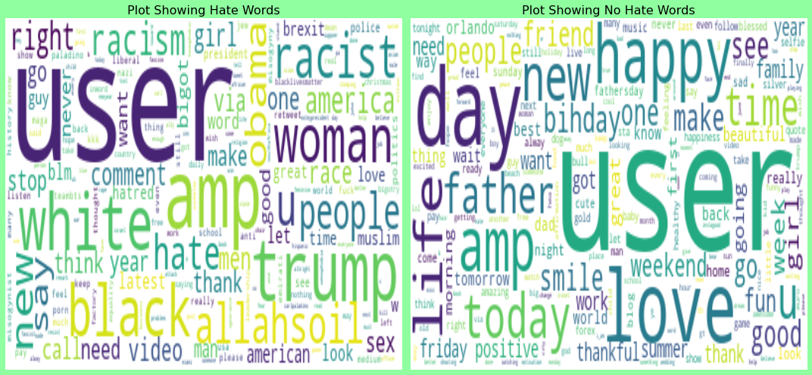

# Twitter Hate Tweets Detection Project

## Introduction

Welcome to the Twitter Hate Tweets Detection Project! The goal of this project is to build a machine-learning model that can automatically detect hate speech and offensive content in tweets posted on Twitter. Hate speech and offensive language have become significant issues in social media platforms, and detecting such content can help in maintaining a positive and inclusive online environment.

## Problem Statement

- **Toxic online content** has become a **major issue** in today’s world.

- This has happened due to an **exponential increase** in the **use of the internet** by people of different cultures and educational backgrounds.

- **Differentiating** hate speech and offensive language is a **key challenge** in the automatic detection of toxic text content.

## Dataset

The dataset used in this project contains tweets along with their corresponding labels indicating whether they are hateful or not. The data might contain noise, misspellings, and other text-related challenges, which require careful preprocessing before building the model.

- The dataset is procured from the twitter website and provided by Jimbard.

| Type | Records | Features | Size |
|:--: | :--: | :--: | :--: |
| Train | 31962 | 2 | 2.79 MB|
| Test | 17197 | 1 | 1.56 MB|

| Id | Features | Description |
| :-- | :--| :--|
|01|**label**|Hate Speech or Not. Contains: [0: No hate speech, 1: Hate speech]|
|02|**tweet**|Tweet given by the user.|

## Data Preprocessing

Before training the hate tweets detection model, we performed essential data preprocessing steps to clean and prepare the text data. These steps include:

1. Removing special characters, URLs, and hashtags.
2. Tokenization: Breaking down sentences into individual words or tokens.
3. Removing stopwords: Common words that do not contribute much to the overall meaning.
4. Lemmatization or stemming: Reducing words to their base or root form.
5. Handling misspellings and abbreviations.

## Model Building

We experimented with two popular machine learning algorithms, Logistic Regression, and Multinomial Naive Bayes, to build the hate tweets detection model. These algorithms have proven to be effective for text classification tasks and were chosen due to their simplicity and interpretability.

## Model Evaluation

To assess the performance of our models, we split the data into training and test sets. The accuracy metric was used to measure the model's performance on the test data. Accuracy is a common metric for binary classification problems, indicating the percentage of correctly predicted instances out of all instances.

## Best Performing Model

After rigorous evaluation, it was observed that the Logistic Regression model outperformed the Multinomial Naive Bayes model, achieving an accuracy of approximately 94% on the test data. The high accuracy suggests that the model can effectively distinguish between hate tweets and non-hate tweets.

## Model Deployment

The Logistic Regression model with its impressive accuracy can be considered for deployment in real-world applications for hate speech detection on Twitter. However, further analysis and testing on larger and more diverse datasets are recommended to ensure robustness and generalization.

## Conclusion

In conclusion, this Twitter Hate Tweets Detection Project aimed to build an effective model that can automatically detect hate speech and offensive content in tweets. By employing various NLP techniques and machine learning algorithms, we addressed the challenges of preprocessing and modeling to achieve a reliable solution.

## Future Considerations

Handling Imbalanced Data:
If the dataset is imbalanced, applying techniques like SMOTE or class weights can help improve the model's performance, especially for hate speech detection, where the positive class (hate tweets) is often less represented.

Fine-Tuning Hyperparameters:
Conducting hyperparameter tuning for the selected model can potentially lead to even better performance. Techniques such as grid search or random search can be employed to find the best combination of hyperparameters.

Advanced NLP Techniques:
Exploring advanced NLP techniques like word embeddings, transformer-based models (e.g., BERT), or deep learning architectures (e.g., LSTM, GRU) might further enhance the model's ability to understand the semantics and context of tweets.

Continuous Model Monitoring:
In real-world deployment, it is essential to continuously monitor the model's performance and retrain it periodically to adapt to changing language patterns and emerging hate speech trends.

Overall, this Twitter Hate Tweets Detection Project lays the foundation for identifying and mitigating hate speech on social media platforms. We hope this project contributes to fostering a more inclusive and respectful online environment.

Feel free to explore the code in the provided Jupyter Notebook and refer to the documentation for more detailed insights into the project.
